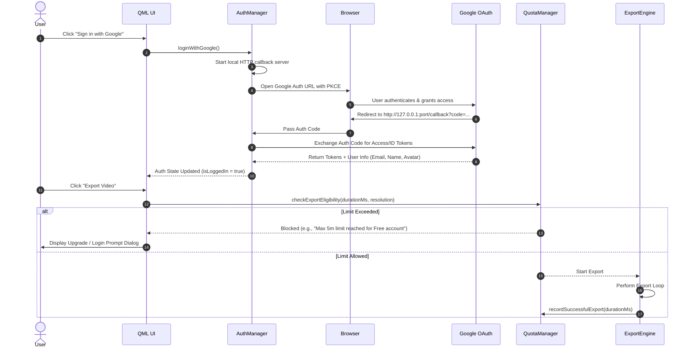

# Implementation Plan - Google Authentication & User Export Limitations

Add Google OAuth 2.0 Login capability to the desktop application and enforce configurable user-based export quotas (e.g., export duration limits, daily export caps, resolution restrictions, and account tiering).

## User Review Required

> [!IMPORTANT]
> **Google OAuth Configuration**: Implementing native Google Login requires creating a **Google Cloud OAuth 2.0 Client ID** (Desktop Application type) with an authorized redirect URI (e.g., `http://127.0.0.1:<port>/callback`).
> We will provide a local PKCE + local HTTP server fallback for development, but official deployment will require setting your Google Client ID and Secret in configuration.

> [!NOTE]
> **Backend vs Local Quota Enforcement**: Quotas can be tracked locally (with encrypted persistence in app data) or synced with a remote backend endpoint (Firebase/Supabase/Custom REST API). This plan includes local persistence with an extensible REST sync interface.

---

## Architecture & Workflow

---

## Proposed Changes

### Core Auth & Quota Modules

#### [NEW] [AuthManager.h](file:///Users/maitraprajapati/Desktop/ssA31/src/auth/AuthManager.h)
#### [NEW] [AuthManager.cpp](file:///Users/maitraprajapati/Desktop/ssA31/src/auth/AuthManager.cpp)
- Implements Google OAuth 2.0 PKCE auth flow using `QTcpServer` for loopback redirect handling and `QNetworkAccessManager` for token exchange.
- Manages user profile information: `userEmail`, `displayName`, `avatarUrl`, `idToken`, and `accountTier` (`Guest`, `Free`, `Pro`).
- Exposes `Q_PROPERTY`s and Q_INVOKABLE methods (`loginWithGoogle()`, `logout()`) to QML.
- Securely stores refresh tokens and session data in encrypted local settings.

#### [NEW] [UserQuotaManager.h](file:///Users/maitraprajapati/Desktop/ssA31/src/auth/UserQuotaManager.h)
#### [NEW] [UserQuotaManager.cpp](file:///Users/maitraprajapati/Desktop/ssA31/src/auth/UserQuotaManager.cpp)
- Defines quota policies based on `AccountTier`:
  - **Guest (Unauthenticated)**: Max duration: 2 mins, Max daily exports: 2, Max resolution: 1080p.
  - **Free User (Google Logged In)**: Max duration: 5 mins, Max daily exports: 5, Max resolution: 1080p.
  - **Pro User**: Unlimited duration, Unlimited daily exports, up to 4K 60FPS.
- Implements `canExport(qint64 durationMs, const QString& resolution, QString& outReason)` validator.
- Records completed exports in local database (`ssa_library.db` or dedicated settings store) with timestamp tracking for daily reset.

---

### Integration into CMake & Engine

#### [MODIFY] [CMakeLists.txt](file:///Users/maitraprajapati/Desktop/ssA31/CMakeLists.txt) & [src/CMakeLists.txt](file:///Users/maitraprajapati/Desktop/ssA31/src/CMakeLists.txt)
- Add `Network` component (`Qt6::Network`) to CMake find_package for HTTP client and OAuth loopback server.
- Register `src/auth/AuthManager.cpp` and `src/auth/UserQuotaManager.cpp` in `SOURCES` and `HEADERS`.

#### [MODIFY] [main.cpp](file:///Users/maitraprajapati/Desktop/ssA31/src/app/main.cpp)
- Instantiate `AuthManager` and `UserQuotaManager`.
- Register them into QML Context (`engine.rootContext()->setContextProperty("authManager", &authManager)` and `"quotaManager", &quotaManager`).

#### [MODIFY] [ExportEngine.cpp](file:///Users/maitraprajapati/Desktop/ssA31/src/export/ExportEngine.cpp)
- Inject `UserQuotaManager` validation into `startExport(...)`.
- Emit export failure/cancellation signal if quota validation fails before starting encoding loop.

---

### UI & QML Components

#### [NEW] [UserProfileBadge.qml](file:///Users/maitraprajapati/Desktop/ssA31/src/ui/components/UserProfileBadge.qml)
- Displays user avatar/initials, user name, and tier status badge in the header/top toolbar.
- Shows dropdown menu on click with remaining export allowance, Google Login / Logout action.

#### [NEW] [ExportQuotaModal.qml](file:///Users/maitraprajapati/Desktop/ssA31/src/ui/components/ExportQuotaModal.qml)
- Glassmorphism dialog displayed when an export attempt violates user limits.
- Highlights exact restriction (e.g. duration limit, daily export cap reached).
- Includes "Sign in with Google" or "Upgrade to Pro" call-to-action buttons.

#### [MODIFY] [EditorView.qml](file:///Users/maitraprajapati/Desktop/ssA31/src/ui/EditorView.qml) & [MainWindow.qml](file:///Users/maitraprajapati/Desktop/ssA31/src/ui/MainWindow.qml)
- Embed `UserProfileBadge` into top menu/toolbar.
- Trigger `ExportQuotaModal` if quota check fails on export button click.

---

## Verification Plan

### Automated & Unit Tests
1. **Quota Validation Logic Test**:
   - Verify `UserQuotaManager::canExport` correctly rejects exports over 2 minutes for `Guest` tier.
   - Verify `UserQuotaManager::canExport` accepts longer exports for `Free` and `Pro` tiers.
   - Verify daily export counter resets correctly when date changes.

2. **Compilation & Build**:
   - Build full application using `cmake --build build` to verify Qt6 Network integration and C++ headers compile cleanly.

### Manual Verification
1. **Google Login Flow**:
   - Click "Sign in with Google" in the application UI.
   - Verify browser opens to Google consent screen.
   - Complete Google login and verify app updates UI state with user profile name and email.
2. **Export Limit Enforcement**:
   - Attempt to export a 3-minute video while unauthenticated (Guest) -> Verify quota modal pops up and blocks export.
   - Sign in with Google (Free tier) -> Verify 3-minute export proceeds, but an 8-minute export is blocked.
   - Verify daily remaining quota counter updates after export finishes.
