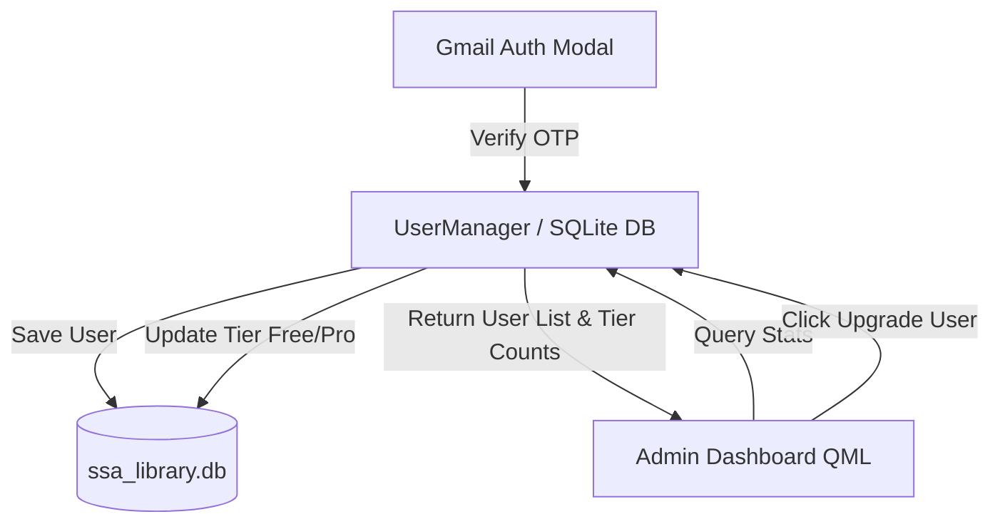

# Implementation Plan - Gmail Verification Cleanup & Owner Admin Dashboard

Remove the admin login toggle from the authentication modal, streamline the Gmail verification flow, and add an **Owner Admin Dashboard** to monitor user registrations, subscription tiers (Free vs Pro), and video export analytics.

---

## User Review Required

> [!IMPORTANT]
> **Admin Dashboard Access**: Since owner login toggle is removed from the user sign-in modal, the Owner Dashboard will be accessible directly via a dedicated **"📊 Admin Dashboard"** icon/button in the top header or via command palette (`Cmd+K` -> "Open Admin Dashboard").

> [!NOTE]
> **User Management & Database**: Registered users, passwords (SHA-256 hashed), account tiers, and export stats will be tracked in SQLite (`ssa_library.db`).

---

## Architecture & Data Flow

---

## Proposed Changes

### Auth & User Management Engine

#### [NEW] [UserManager.h](file:///Users/maitraprajapati/Desktop/ssA31/src/auth/UserManager.h)
#### [NEW] [UserManager.cpp](file:///Users/maitraprajapati/Desktop/ssA31/src/auth/UserManager.cpp)
- Manages user database table (`users`) in `ssa_library.db`:
  - `id`, `email`, `username`, `password_hash`, `tier` (0: Guest, 1: Free, 2: Pro), `registered_at`, `last_active_at`, `total_exports`.
- Exposes stats:
  - `totalUsersCount`: Total registered users.
  - `proUsersCount`: Number of Pro users.
  - `freeUsersCount`: Number of Free Google users.
  - `totalExportsCount`: Total videos exported across all users.
- Provides functions:
  - `registerOrUpdateUser(email, username, passwordHash, tier)`
  - `setUserTier(email, tier)` (Upgrade to Pro / Downgrade to Free)
  - `deleteUser(email)`

#### [MODIFY] [AuthManager.cpp](file:///Users/maitraprajapati/Desktop/ssA31/src/auth/AuthManager.cpp) & [AuthManager.h](file:///Users/maitraprajapati/Desktop/ssA31/src/auth/AuthManager.h)
- Remove `loginWithAdmin` method and admin mode toggles.
- Connect user sign-in to `UserManager` to log registrations and active sessions.

---

### Dashboard & UI Components

#### [MODIFY] [EmailAuthModal.qml](file:///Users/maitraprajapati/Desktop/ssA31/src/ui/components/EmailAuthModal.qml)
- Remove "Admin Login (Unlimited)" tabs and `admin` shortcuts.
- Keep pure, clean **Gmail Login & 6-digit OTP verification** flow.

#### [NEW] [AdminDashboard.qml](file:///Users/maitraprajapati/Desktop/ssA31/src/ui/components/AdminDashboard.qml)
- Dark glassmorphic analytics dashboard showing:
  - **Stat Cards**: Total Users, Pro Subscribers, Free Accounts, Total Video Exports.
  - **User Table View**: List of registered users with Email, Username, Plan Tier, Export Count, and a **"Toggle Pro/Free"** button.
  - Search & filter box for users.

#### [MODIFY] [WorkspaceView.qml](file:///Users/maitraprajapati/Desktop/ssA31/src/ui/WorkspaceView.qml) & [MainWindow.qml](file:///Users/maitraprajapati/Desktop/ssA31/src/ui/MainWindow.qml)
- Add **"📊 Admin Dashboard"** button in header toolbar.
- Instantiate `AdminDashboard.qml` overlay.

---

## Verification Plan

### Automated & Build Verification
1. `cmake --build build`: Verify clean compilation with zero warnings.
2. Launch executable `./build/src/SSA.app/Contents/MacOS/SSA`.

### Manual Verification
1. **Gmail Sign-In**: Register user with `test@gmail.com` -> verify email is added to user table.
2. **Admin Dashboard**: Open Admin Dashboard -> verify Stat Cards show correct counts.
3. **Upgrade User**: Click "Upgrade to Pro" for a user -> verify tier changes to Pro and export limits are lifted.
